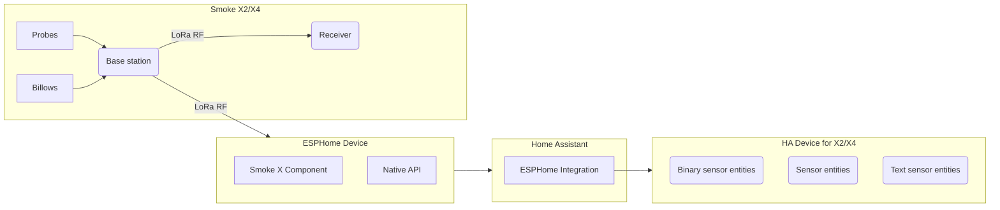

# ThermoWorks Smoke X2 and X4 Receiver - ESPHome Component

This is an ESPHome external component based on the excellent work in https://github.com/G-Two/smoke-x-receiver that receives the RF signal from a [ThermoWorks Smoke X2](https://www.thermoworks.com/smokex2/) or [Smoke X4](https://www.thermoworks.com/smokex4/) remote thermometer and integrates it with Home Assistant via ESPHome. This will work alongside any existing Smoke X2/X4 receivers (i.e. all paired receivers will still function). The component is designed specifically for the Heltec LoRa32 v3 board with built-in LoRa capabilities.

> **Note**
> This application is **<ins>not</ins>** compatible with the original [ThermoWorks Smoke](https://www.thermoworks.com/smoke/) or [ThermoWorks Signals](https://www.thermoworks.com/signals/) products.

---

- [Motivation](#motivation)
- [Acknowledgments](#acknowledgments)
- [Requirements](#requirements)
- [Installation](#installation)
- [Configuration](#configuration)
- [Syncing Process](#syncing-process)
- [Home Assistant Integration](#home-assistant-integration)
- [Development](#development)

---

## Motivation

The Smoke X is solidly built, accurate, has great RF range, and doesn't need the internet to function. But the provided receiver unit only shows current probe readings, with no means of recording or tracking trends.


This ESPHome component allows Smoke X users to collect the temperature data from the RF signal and integrate it seamlessly with Home Assistant for visualization and automation.


All data is acquired, processed, and stored locally as shown below:



The ESPHome component provides native integration with Home Assistant, making all temperature data, alarms, and probe status available for dashboards, automations, and historical tracking.

## Acknowledgments

This ESPHome component is based on the original [smoke-x-receiver](https://github.com/G-Two/smoke-x-receiver) project by [G-Two](https://github.com/G-Two). The original project provided the foundation for understanding the Smoke X protocol and LoRa communication implementation. This ESPHome version maintains compatibility with the same hardware while providing a more streamlined integration path for ESPHome users.

## Requirements

### Hardware

- **Heltec LoRa32 v3 board** (ESP32-S3 with SX1262 LoRa radio)
  - This component is specifically designed for this board's pin configuration
  - Other ESP32 boards with LoRa modules may work with pin configuration adjustments
- **Thermoworks Smoke X2 or X4 transmitter**

### Software

- [ESPHome](https://esphome.io/) (can be installed as Home Assistant add-on or standalone)
- [Home Assistant](https://www.home-assistant.io/) (recommended for full integration)

---

## Installation

### 1. Add External Component

Add the Smoke X external component to your ESPHome configuration:

```yaml
external_components:
  - source:
      type: local
      path: /path/to/smoke-x-receiver/esphome_component/components
    components: [ smoke_x ]
```

Or if using from GitHub:

```yaml
external_components:
  - source: github://G-Two/smoke-x-receiver@esphome
    components: [ smoke_x ]
```

### 2. Basic Configuration

Create a new ESPHome configuration file or add to an existing one:

```yaml
# SPI configuration for LoRa
spi:
  clk_pin: GPIO9    # LoRa_SCK
  mosi_pin: GPIO10  # LoRa_MOSI
  miso_pin: GPIO11  # LoRa_MISO

# Smoke X component
smoke_x:
  id: smoke_x_receiver
  cs_pin: GPIO8           # LoRa_NSS
  lora_rst_pin: GPIO12    # LoRa_RST
  lora_busy_pin: GPIO13   # LoRa_BUSY
  lora_dio1_pin: GPIO14   # LoRa_DIO1
```

### 3. Flash to Device

Use ESPHome to compile and upload:

```bash
esphome run your-config.yaml
```

Or use the ESPHome Dashboard if running as a Home Assistant add-on.

---

## Configuration

### Complete Example

See `example_smoke_x_config.yaml` in the repository for a complete working configuration including all sensor types.

### Sensor Configuration

The component provides various sensor types that can be added to your configuration:

```yaml
# Text sensors
text_sensor:
  - platform: smoke_x
    device_id:
      name: "Smoke X Device ID"
    units:
      name: "Smoke X Units"

# Binary sensors
binary_sensor:
  - platform: smoke_x
    synced:
      name: "Smoke X Synced"
    billows_attached:
      name: "Billows Attached"
    probe_attached:
      - index: 1
        name: "Probe 1 Attached"
      - index: 2
        name: "Probe 2 Attached"
    probe_alarm:
      - index: 1
        name: "Probe 1 Alarm"
      - index: 2
        name: "Probe 2 Alarm"

# Temperature sensors
sensor:
  - platform: smoke_x
    temperature:
      - index: 1
        name: "Probe 1 Temperature"
      - index: 2
        name: "Probe 2 Temperature"
    alarm_max:
      - index: 1
        name: "Probe 1 Max Alarm"
      - index: 2
        name: "Probe 2 Max Alarm"
    alarm_min:
      - index: 1
        name: "Probe 1 Min Alarm"
      - index: 2
        name: "Probe 2 Min Alarm"
```

## Syncing Process

1. When first powered on, the receiver will alternate between 920 MHz (X2) and 915 MHz (X4) frequencies
2. Put your Smoke X transmitter in pairing mode (hold the button until it beeps)
3. The receiver will automatically sync and save the configuration
4. After syncing, the receiver will stay on the paired frequency and receive updates every 30 seconds

To manually trigger re-sync, add a button to your configuration:

```yaml
button:
  - platform: template
    name: "Smoke X Sync"
    on_press:
      - lambda: |-
          auto smoke_x = id(smoke_x_receiver);
          smoke_x->trigger_sync();
```

## Home Assistant Integration

ESPHome provides native integration with Home Assistant. Once the device is added to Home Assistant through the ESPHome integration, all configured sensors will automatically appear with appropriate device classes, units, and icons.

The component creates a single device in Home Assistant with the following entities:

### Text Sensors
- **Device ID**: Shows the synced Smoke X transmitter ID
- **Units**: Displays current temperature units (°F or °C)

### Binary Sensors
- **Synced**: Whether the receiver is synced with a transmitter
- **Billows Attached**: Whether a Billows fan is connected
- **Probe Attached**: Connection status for each probe (up to 4)
- **Probe Alarm**: Alarm status for each probe (up to 4)

### Numeric Sensors
- **Temperature**: Current temperature for each probe
- **Alarm Max**: Maximum temperature alarm threshold for each probe
- **Alarm Min**: Minimum temperature alarm threshold for each probe

All sensors update automatically when the Smoke X transmitter sends data (every 30 seconds).

## MQTT Support (Optional)

While ESPHome typically uses its native API for Home Assistant communication, you can optionally configure MQTT:

```yaml
mqtt:
  broker: 192.168.1.100
  username: mqtt_user
  password: mqtt_password
```

With MQTT enabled, all sensor data will also be published to MQTT topics following ESPHome's standard naming convention.

---

## Development

PRs to fix bugs or enhance/add functionality are welcome!

### Component Structure

The ESPHome component is located in `esphome_component/components/smoke_x/` and consists of:

- `__init__.py` - Component configuration and setup
- `smoke_x_component.h/cpp` - Core C++ implementation
- `sensor.py` - Temperature sensor definitions
- `binary_sensor.py` - Binary sensor definitions
- `text_sensor.py` - Text sensor definitions

### Debugging

Enable verbose logging in your ESPHome configuration:

```yaml
logger:
  level: VERBOSE
  logs:
    smoke_x: VERY_VERBOSE
```

Monitor logs using:
```bash
esphome logs your-config.yaml
```

### Protocol Details

The Smoke X uses LoRa communication at:
- 920 MHz for initial X2 sync
- 915 MHz for initial X4 sync
- Device-specific frequency after pairing

Data is transmitted every 30 seconds with probe temperatures, alarm thresholds, and status information.

### Contributing

1. Fork the repository
2. Create a feature branch
3. Test with actual Smoke X hardware
4. Submit a pull request

### Future Enhancements

- Support for additional LoRa hardware beyond Heltec LoRa32 v3
- Historical data storage and graphing
- Advanced automation triggers
- Support for multiple Smoke X transmitters
